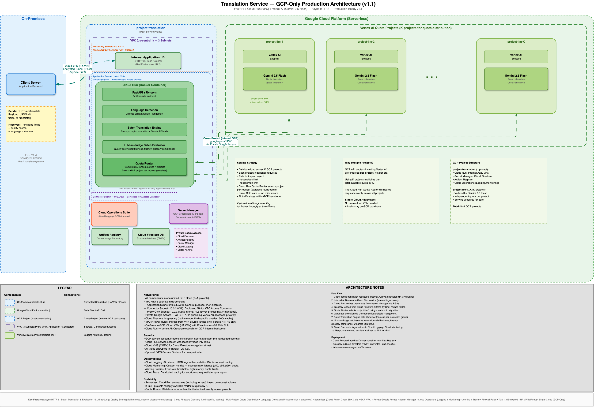

# Translation Service - GCP Production Architecture Documentation (v1.1)

## Architecture Diagram

See [architecture-gcp.drawio](architecture-gcp.drawio) for the complete production architecture diagram.

## Overview

The Translation Service is a production-ready, serverless application that translates text fields to Hebrew using Google's Gemini 2.5 Flash model via Vertex AI. The architecture runs entirely on Google Cloud Platform with on-premises client connectivity via Cloud VPN (HA VPN).

Key characteristics:
- **Serverless compute** via Cloud Run (auto-scales to zero)
- **Multi-project quota distribution** across K Vertex AI projects
- **Batch translation & evaluation** — multiple fields per LLM call for efficiency
- **Form-kind-specific glossaries** stored in Cloud Firestore with in-memory caching
- **Private networking** with VPC, Private Google Access, and no public internet exposure
- **Comprehensive observability** via Cloud Operations Suite (Logging, Monitoring, Trace)

## Technology Stack

### Complete Technology Matrix

| Layer | Component | Technology/Service | Version/Details | Purpose |
|-------|-----------|-------------------|-----------------|---------|
| **Application Framework** | Web Framework | FastAPI | Latest | REST API framework with async support |
| | ASGI Server | Uvicorn | Latest | High-performance async server |
| | Language Detection | langdetect + Unicode script analysis | Latest | Auto-detect source language (en, fr, es, ar, ru) |
| | Configuration | pydantic-settings | Latest | Environment-based configuration |
| | Runtime | Python | 3.11+ | Application runtime |
| **AI/ML Services** | LLM Provider | Google Vertex AI | Gemini 2.5 Flash | Translation and quality evaluation |
| | SDK | google-genai | Latest | Official Google Gen AI SDK (async client) |
| | Quality Evaluation | LLM-as-Judge | Custom | Faithfulness, fluency, and glossary compliance scoring |
| **GCP - Compute** | Load Balancer | Internal Application Load Balancer | L7 HTTP(S) | Internal API endpoint (VPN-accessible) |
| | Serverless Compute | Cloud Run | Container (Docker) | Serverless container execution |
| | Container Registry | Artifact Registry | Docker format | Docker image storage |
| **GCP - Networking** | Virtual Network | VPC | Custom mode | Network isolation |
| | Application Subnet | VPC Subnet | 10.0.1.0/24 | General-purpose subnet, Private Google Access enabled |
| | Connector Subnet | VPC Subnet | 10.0.2.0/28 | Dedicated /28 for Serverless VPC Access connector |
| | Proxy-Only Subnet | VPC Subnet | 10.0.3.0/24 | Required by Internal ALB (GCP-managed Envoy proxies) |
| | Serverless Connector | Serverless VPC Access | - | Cloud Run → VPC connectivity (uses Connector Subnet) |
| | Private Access | Private Google Access | - | Private access to GCP APIs |
| | Private Connectivity | Private Service Connect | - | Private endpoints for managed services |
| | Network Security | VPC Firewall Rules | - | Ingress/egress rules |
| | On-Prem Connectivity | Cloud VPN (HA VPN) | IPsec | Encrypted tunnels to on-premises |
| **GCP - Storage** | Glossary Database | Cloud Firestore | Native mode, CMEK | Form-kind-specific glossary entries with 300s TTL cache |
| | Container Registry | Artifact Registry | Docker format | Docker image storage |
| **GCP - Security** | Secrets Management | Secret Manager | Encrypted at rest | GCP service account credentials (K projects) |
| | Access Control | Cloud IAM | Roles & Service Accounts | Least-privilege access |
| | Data Perimeter | VPC Service Controls | Optional | Prevent data exfiltration |
| | Encryption Keys | Cloud KMS | CMEK | Customer-managed encryption keys |
| **GCP - Observability** | Logging | Cloud Logging | JSON structured | Request tracing with correlation IDs |
| | Metrics | Cloud Monitoring | Custom metrics | Success rate, latency, quota usage |
| | Alerting | Cloud Monitoring Alerting Policies | - | Error rate, latency, quota thresholds |
| | Tracing | Cloud Trace | Distributed tracing | Request latency analysis |
| | Error Tracking | Error Reporting | Automatic grouping | Aggregated error tracking |
| **GCP - AI Platform** | AI Platform | Vertex AI | - | Managed AI/ML platform |
| | LLM Model | Gemini 2.5 Flash | - | Translation and evaluation model |
| | Multi-Project Setup | K GCP Projects | Stateless round-robin | Quota multiplication strategy |
| | Authentication | Service Accounts | JSON key files | Per-project authentication (ADC) |
| **Infrastructure** | IaC Tool | Terraform | - | Infrastructure as Code |
| | Deployment | Docker Container | Multi-stage build | Cloud Run container image |
| **Application Logic** | Batch Translation Engine | Custom | Python | Batch prompt construction + API orchestration |
| | Batch Evaluator | Custom | Python | Batch quality scoring with weighted overall score |
| | Quota Router | Custom | Round-robin/random | Multi-project load distribution |
| | Language Detector | Custom wrapper | langdetect + Unicode script | Source language identification |
| | Glossary Manager | Custom | Python + Firestore | Kind-specific glossary CRUD with caching |
| | Retry Logic | Custom | Exponential backoff | Transient error handling with configurable retries |
| **Protocols** | Client-GCP | HTTPS over VPN | IPsec + TLS 1.3 | Encrypted requests via HA VPN |
| | Internal GCP | HTTPS | TLS 1.3 | Service-to-service communication |

### Key Technology Decisions

1. **Serverless Architecture**: Cloud Run eliminates infrastructure management and provides automatic scaling (including scale-to-zero)
2. **Container-based Cloud Run**: Docker packaging allows complex dependencies (FastAPI, google-genai SDK)
3. **Internal Load Balancer**: L7 Internal Application Load Balancer provides URL routing, health checks, and SSL termination for VPN-accessible traffic
4. **VPC with Private Google Access**: All managed services accessed privately, no public internet exposure
5. **Serverless VPC Access**: Cloud Run connects to VPC resources through a managed connector
6. **Multi-Project GCP**: Quota multiplication strategy (K projects = K × quota limit)
7. **Stateless Quota Router**: Round-robin selection enables horizontal scaling
8. **Direct SDK Calls**: google-genai SDK without middleware
9. **Batch LLM Calls**: Multiple fields translated/evaluated in a single LLM call, reducing API round-trips
10. **LLM-as-Judge**: Quality evaluation with three dimensions (faithfulness, fluency, glossary compliance) and weighted overall scoring
11. **Cloud Firestore for Glossary**: Form-kind-specific glossary entries with async access and 300-second TTL caching
12. **Script-based Language Detection**: Unicode script analysis for Hebrew/Arabic/Cyrillic prevents LLM misdetection on short inputs; Latin-script languages deferred to LLM
13. **Structured JSON Logging**: Cloud Logging with log-based metrics and correlation IDs

## Architecture Components

### On-Premises Infrastructure
- **Client Server**: Application backend that sends translation requests
- **Connectivity**: Cloud VPN (HA VPN) with IPsec encrypted tunnels to GCP

### Google Cloud Platform (Serverless)

#### Networking

**VPC (Custom Mode)** — Custom VPC in `us-central1` with 3 subnets:

| Subnet | CIDR | Purpose |
|--------|------|---------|
| **Application Subnet** | `10.0.1.0/24` | General-purpose subnet for VPC resources. Private Google Access (PGA) enabled for private API access. |
| **Connector Subnet** | `10.0.2.0/28` | Dedicated `/28` for Serverless VPC Access connector (minimum `/28` required by GCP). Bridges Cloud Run to VPC. |
| **Proxy-Only Subnet** | `10.0.3.0/24` | Required by Regional Internal Application Load Balancer. Hosts GCP-managed Envoy proxy instances. Cannot contain user resources. |

- No external IP addresses assigned to any resources
- Private Google Access enabled on Application Subnet

**Cloud VPN (HA VPN)**:
  - Two IPsec tunnels for 99.99% SLA
  - BGP routing for dynamic route exchange
  - Connects on-premises network to GCP VPC
  - Terminates in Application Subnet

**Serverless VPC Access Connector**:
  - Connects Cloud Run to VPC via dedicated Connector Subnet (`10.0.2.0/28`)
  - Enables access to VPC-internal resources
  - Enables egress through VPC for all traffic
  - Connector instances are GCP-managed within the `/28` range

**Private Google Access / Private Service Connect**:
  - Cloud Firestore accessed privately from VPC
  - Secret Manager accessed privately
  - Artifact Registry accessed privately
  - Cloud Logging accessed privately
  - Vertex AI APIs accessed privately (cross-project)

**VPC Firewall Rules**:
  - Allow ingress from on-prem CIDR via VPN (HTTPS only)
  - Allow ingress from Internal Load Balancer health check ranges (GCP ranges `35.191.0.0/16`, `130.211.0.0/22`)
  - Allow ingress from Proxy-Only Subnet to application backends
  - Deny all other ingress
  - Allow egress to Google APIs (`restricted.googleapis.com`)
  - Allow egress to Vertex AI endpoints

#### Compute
- **Internal Application Load Balancer**: L7 HTTP(S) load balancer
  - Internal IP accessible via Cloud VPN
  - URL maps route `/api/translate` to Cloud Run backend
  - Health checks on `/health` endpoint
  - SSL termination with managed certificate

- **Cloud Run (Docker Container)**: Serverless compute
  - FastAPI + Uvicorn application
  - Language Detection (langdetect + Unicode script analysis)
  - Batch Translation Engine (multiple fields per Gemini API call)
  - LLM-as-Judge Batch Evaluator (faithfulness, fluency, glossary compliance)
  - Glossary Manager (Firestore-backed, kind-specific, cached)
  - Quota Router (multi-project load distribution)
  - Retry logic with exponential backoff for transient errors
  - **Configuration**:
    - Min instances: 0 (scale to zero)
    - Max instances: 100 (configurable)
    - CPU: 1-2 vCPUs
    - Memory: 512Mi - 1Gi
    - Concurrency: 80 requests per instance
    - Ingress: Internal only (+ Cloud Load Balancing)
    - VPC egress: All traffic through VPC connector

#### Security & Secrets
- **Secret Manager**: Stores GCP service account credentials for K projects
  - Encrypted at rest with Google-managed or CMEK keys
  - Access via Cloud IAM (no hardcoded secrets)
  - Automatic rotation support
  - Versioned secrets with audit logging

- **Cloud IAM**:
  - Cloud Run service account with least-privilege roles:
    - `roles/secretmanager.secretAccessor` (read secrets)
    - `roles/datastore.user` (read/write glossary in Firestore)
    - `roles/logging.logWriter` (write logs)
    - `roles/monitoring.metricWriter` (write metrics)
  - No default service account usage

- **VPC Service Controls** (Optional):
  - Security perimeter around the project
  - Prevents data exfiltration to unauthorized projects

#### Storage
- **Artifact Registry**: Docker container image repository
  - Docker format repository in us-central1
  - Vulnerability scanning enabled
  - Accessed privately via Private Google Access

- **Cloud Firestore**: Glossary database
  - Native mode, `glossarydb` database
  - `glossary_entries` collection with per-document `kind` field
  - Supports form-kind-specific queries (`general` + kind-specific entries)
  - CMEK encryption (Cloud KMS)
  - Accessed privately via Private Google Access
  - Application-level caching with 300-second TTL

#### Observability
- **Cloud Logging**:
  - Structured JSON logs with correlation IDs for request tracing
  - Log-based metrics for custom dashboards
  - Retention: 30 days default (configurable)

- **Cloud Monitoring**:
  - **Custom Metrics**: Translation success count, latency (ms), quality scores, quota usage per GCP project
  - **Dashboards**: Service overview, per-project quota usage, quality score distribution
  - **Uptime Checks**: Health endpoint monitoring

- **Cloud Monitoring Alerting Policies**:
  - Error rate > 5% threshold
  - p99 latency > 10 seconds
  - Quota approaching limits per project
  - Health check failures
  - Notification channels: Email, PagerDuty, Slack

- **Cloud Trace**:
  - Distributed tracing for request latency analysis
  - Automatic instrumentation for Cloud Run
  - End-to-end request visibility

- **Error Reporting**:
  - Automatic error grouping and deduplication
  - Stack trace analysis
  - New error notifications

### Vertex AI (Multi-Project)

#### Multiple GCP Projects (K projects for quota distribution)
- Each project: Independent token/sec and token/min quotas
- Quota Router selects project per request (stateless round-robin)
- Total available quota = single project quota × K

#### Scaling Strategy
- Distribute load across K GCP projects
- Direct SDK calls (google-genai)
- Optional: Multi-region routing for resilience

## Data Flow

1. **Request Initiation**: Client sends POST /api/translate (with optional `kind` for form-specific glossary) via encrypted HA VPN tunnel to Internal Load Balancer
2. **Load Balancer Routing**: Internal ALB routes request to Cloud Run service
3. **Credential Retrieval**: Cloud Run fetches GCP service account credentials from Secret Manager (via Private Google Access)
4. **Glossary Loading**: Fetches glossary entries from Cloud Firestore filtered by `kind` (general + kind-specific); results cached for 300 seconds
5. **Project Selection**: Quota Router selects GCP project using round-robin algorithm
6. **Language Detection**: Unicode script analysis for Hebrew/Arabic/Cyrillic; LLM-based detection for Latin-script languages (en, fr, es)
7. **Batch Translation**:
   - Groups fields by instruction type (`default` vs `exact`)
   - Constructs batch prompt with glossary terms per group
   - Calls Vertex AI Gemini 2.5 Flash via google-genai SDK (one call per instruction group)
8. **Batch Quality Evaluation**: LLM-as-Judge scores all translations in a single call (faithfulness, fluency, glossary compliance); weighted overall score computed (60/20/20)
9. **Logging**: Emits structured logs and custom metrics to Cloud Logging / Cloud Monitoring
10. **Response**: Returns translations + per-field metadata + quality scores + status to client via Internal ALB → VPN

## Security Features

### Network Security
- ✅ VPC with Private Google Access (no public IPs)
- ✅ VPC Firewall Rules restrict ingress to VPN source ranges only
- ✅ Private Google Access for all managed service communication
- ✅ Cloud VPN (HA VPN) with IPsec for on-premises connectivity
- ✅ Cloud Run ingress set to "Internal only"
- ✅ Serverless VPC Access for Cloud Run → VPC connectivity

### Encryption
- ✅ TLS 1.3 for all traffic in transit
- ✅ IPsec for VPN tunnels
- ✅ CMEK (Cloud KMS) for Cloud Firestore encryption at rest
- ✅ Secret Manager encrypted at rest (Google-managed or CMEK)
- ✅ Artifact Registry images encrypted at rest

### Access Control
- ✅ Cloud IAM with least-privilege service accounts
- ✅ No hardcoded credentials
- ✅ GCP service accounts per Vertex AI project with minimal permissions
- ✅ No default service account usage

### Audit & Compliance
- ✅ Cloud Audit Logs (Admin Activity, Data Access)
- ✅ Secret Manager access audit trail
- ✅ Cloud Asset Inventory for resource tracking

## Observability

### Logging
- **Structured JSON format**: Machine-readable logs via Cloud Logging
- **Correlation IDs**: Track requests across components
- **Context-rich**: Includes field names, GCP project used, source language, glossary kind, errors
- **Retention**: 30 days (configurable, with log sinks for archival)
- **Log-based Metrics**: Automatically extract metrics from log entries

### Metrics
- **Application Metrics** (Cloud Monitoring custom metrics):
  - Translation success count (`custom.googleapis.com/translation/success_count`)
  - Translation latency in milliseconds (`custom.googleapis.com/translation/latency_ms`)
  - Quality scores distribution (`custom.googleapis.com/translation/quality_score`)
  - Quota usage per GCP project (`custom.googleapis.com/translation/quota_usage`)

- **Cloud Run Metrics** (built-in):
  - Request count, latency, error rate
  - Container instance count
  - CPU/memory utilization
  - Cold start count and latency
  - Billable instance time

- **Load Balancer Metrics** (built-in):
  - Request count
  - Latency (p50, p95, p99)
  - 4XX/5XX error rates
  - Backend health

### Alerting Policies
- Error rate > 5% threshold
- p99 latency > 10 seconds
- Quota approaching limits
- Health check failures
- Cloud Run instance scaling alerts

### Tracing
- **Cloud Trace**: End-to-end distributed tracing
  - Automatic instrumentation for Cloud Run
  - Latency breakdown by component
  - Integration with Cloud Logging for correlated log entries

## Scalability

### Serverless Auto-Scaling
- Cloud Run automatically scales based on request volume
- Scale-to-zero when idle (cost savings)
- Maximum instances configurable per service
- Concurrency-based scaling (multiple requests per instance)
- No infrastructure provisioning required
- Pay-per-use model (CPU/memory billed only during request handling)

### Multi-Project Quota Management
- K GCP projects multiply available Vertex AI quota
- Stateless round-robin distribution ensures even load
- No single project becomes a bottleneck

### High Availability
- Cloud Run deploys across multiple zones automatically
- Internal ALB distributes traffic across healthy instances
- HA VPN provides 99.99% SLA with redundant tunnels
- Cloud Run SLA: 99.95% availability

## Production Readiness Checklist

- ✅ **VPC Isolation**: Private networking with no public internet exposure
- ✅ **Secrets Management**: Secret Manager (no hardcoded credentials)
- ✅ **Logging & Monitoring**: Cloud Logging, Cloud Monitoring, Alerting Policies
- ✅ **Firewall Rules**: Network-level access controls
- ✅ **Encryption**: TLS 1.3 in transit, CMEK at rest
- ✅ **High Availability**: Multi-zone Cloud Run + HA VPN
- ✅ **Auto-Scaling**: Serverless compute scales automatically (including to zero)
- ✅ **Quota Management**: Multi-project distribution prevents limits
- ✅ **IAM Least-Privilege**: Service account-based access control
- ✅ **Infrastructure as Code**: Terraform for reproducibility
- ✅ **Distributed Tracing**: Cloud Trace for latency analysis
- ✅ **Error Tracking**: Error Reporting for aggregated error management
- ✅ **Audit Logging**: Cloud Audit Logs for compliance

## Cost Estimates (Monthly)

Based on 1M requests/month, 3s average request duration:

| Service | Configuration | Estimated Cost |
|---------|--------------|----------------|
| Cloud Run | 1M requests, 1 vCPU, 512Mi, 3s avg | $15 |
| Internal Load Balancer | 1M requests, forwarding rules | $20 |
| Cloud Logging | 10GB ingestion, 30-day retention | $5 |
| Cloud Monitoring | 20 custom metrics | $5 |
| Secret Manager | 10 secrets, 1M access operations | $1 |
| Cloud Firestore | 1M reads, 100K writes, 1GB storage | $1 |
| Artifact Registry | 5GB storage | $0.50 |
| Cloud VPN (HA VPN) | 2 tunnels | $73 |
| Serverless VPC Access | 1 connector (e2-micro) | $7 |
| **Total** | | **~$128/month** |

## Key Architectural Patterns

### 1. Multi-Project Quota Distribution
- **Problem**: Single GCP project has limited Vertex AI quota (tokens/sec, tokens/min)
- **Solution**: Deploy K identical GCP projects, each with independent quotas
- **Implementation**: Cloud Run Quota Router uses stateless round-robin to select project per request
- **Benefit**: Total available quota = single project quota × K

### 2. VPC-based Security (GCP Native)
- **3-Subnet VPC**: Application Subnet (`10.0.1.0/24`), Connector Subnet (`10.0.2.0/28`), Proxy-Only Subnet (`10.0.3.0/24`)
- **Private Networking**: Cloud Run with internal-only ingress, VPC with Private Google Access
- **Serverless VPC Access**: Managed connector in dedicated `/28` subnet for Cloud Run → VPC connectivity
- **Private Google Access**: All GCP APIs accessed privately (no internet gateway)
- **Firewall Rules**: Ingress restricted to VPN source ranges, health check ranges, and proxy-only subnet only

### 3. Internal Load Balancer Pattern
- **Internal ALB**: L7 load balancer with internal IP accessible via Cloud VPN
- **URL Maps**: Route `/api/translate` to Cloud Run backend service
- **Health Checks**: Automatic health monitoring on `/health` endpoint
- **SSL Termination**: Managed certificate for HTTPS termination

### 4. Async HTTPS Pattern
- **Client → GCP**: Encrypted HA VPN tunnel (IPsec)
- **Internal GCP**: HTTPS calls between services
- **Non-blocking**: FastAPI async/await pattern for concurrent processing

### 5. Batch Translation & Evaluation
- **Batch Translation**: Fields grouped by instruction type (`default`/`exact`), translated in a single LLM call per group
- **Batch Evaluation**: All translations evaluated in one LLM call; same Gemini model scores on three dimensions:
  - **Faithfulness** (weight 60%): Semantic accuracy to source text
  - **Fluency** (weight 20%): Natural Hebrew expression
  - **Glossary Compliance** (weight 20%): Adherence to glossary terminology
- **Weighted Overall Score**: Computed server-side for consistency (not LLM-generated)
- **Response**: Client receives translations + per-field quality scores + status metadata

### 6. Form-Kind-Specific Glossaries
- **Problem**: Different form types (e.g., consular, immigration) require specialized terminology
- **Solution**: Glossary entries tagged with `kind` field in Firestore; queries return `general` + kind-specific entries
- **Caching**: 300-second TTL in-memory cache keyed by `kind` to reduce Firestore reads
- **Management**: CRUD API endpoints + migration scripts for bulk import

## Version History

- **v1.1** (Current): Batch translation/evaluation, Cloud Firestore glossary with kind-specific filtering, enhanced Unicode script-based language detection, weighted quality scoring (faithfulness/fluency/glossary compliance), retry logic with exponential backoff
- **v1.0**: Production architecture with Cloud Run, Internal ALB, HA VPN, multi-project quota distribution, Cloud Operations observability

## Viewing the Diagram

Open `docs/architecture-gcp.drawio` in:
- **Draw.io Desktop App**: Download from https://www.diagrams.net/
- **Draw.io Web**: Visit https://app.diagrams.net/ and open the file
- **VS Code**: Install the "Draw.io Integration" extension

The diagram includes:
- Complete component layout with proper spacing
- Color-coded zones (On-Premises, GCP VPC, Multi-Project Vertex AI)
- Network connectivity arrows with encryption labels
- Comprehensive legend explaining all symbols and connection types
- Detailed architecture notes panel
